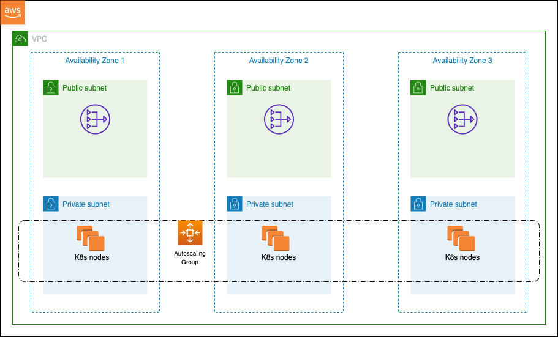

## AWS EKS

### VPC for EKS Cluster
A new VPC will be created for the EKS cluster with the design recommended by AWS EKS official documentation.

Various Configurations are:
- Public and private subnets (default)
- Only public subnets
- Only private subnets (not yet supported)

**References**
- https://docs.aws.amazon.com/eks/latest/userguide/create-public-private-vpc.html
- https://docs.aws.amazon.com/eks/latest/userguide/network_reqs.html

### Architecture diagram of default config

### Worker node options
- Self Managed EC2 instances with autoscaling group (default) - worker groups
- Self Managed EC2 instances with autoscaling group - worker groups with launch template (not yet supported)
- AWS Managed EC2 instances - node groups (not yet supported)
- AWS Managed EC2 instances - node groups with launch template (not yet supported)
- Fargate (not yet supported)

### Set up Public Cluster
In public cluster, all worker nodes will be accessible from internet with external ip. To set it up, configure empty array for `k8s_cluster.private_subnets`

### Access worker nodes via SSH
To ssh into worker nodes, we need a key pair mounted into worker nodes.
To do so, create a key pair before running this script and while running this terraform script, configure the name of that key pair in `worker_groups.key_name`.
